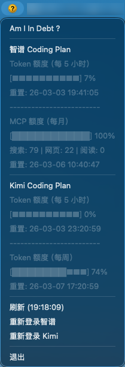

# Am I In Debt

[](https://opensource.org/licenses/MIT)
[](https://www.apple.com/macos)
[](https://www.rust-lang.org/)
[](https://bun.sh/)

一个 macOS 状态栏应用，用于监控多个 Coding Plan（智谱、Kimi）的使用情况。



## 功能特性

- 🍎 **纯状态栏应用**：不在 Dock 栏显示图标
- 📊 **多平台支持**：支持智谱 Coding Plan 和 Kimi Coding Plan
- 🔐 **自动化登录**：使用 Chrome DevTools Protocol 自动获取 cookies
- 📈 **使用情况展示**：显示已用/总计/剩余 tokens、进度条、重置时间
- 🔄 **自动刷新**：每 30 秒自动更新数据，支持手动刷新
- 💾 **XDG 规范存储**：数据存储在 `~/.local/share/am-i-in-debt/`

## 技术栈

- **应用框架**：Tauri 2.x
- **后端语言**：Rust
- **脚本语言**：TypeScript (Bun runtime)
- **浏览器自动化**：Chrome DevTools Protocol (`chrome-remote-interface`)

## 项目结构

```
am-i-in-debt/
├── src-tauri/
│   ├── src/
│   │   ├── main.rs        # 应用入口
│   │   ├── lib.rs         # 库导出
│   │   ├── api/           # API 客户端
│   │   │   ├── mod.rs
│   │   │   ├── zhipu.rs
│   │   │   └── kimi.rs
│   │   ├── models/        # 数据结构
│   │   │   ├── mod.rs
│   │   │   ├── zhipu.rs
│   │   │   └── kimi.rs
│   │   ├── menu.rs        # 菜单逻辑
│   │   ├── state.rs       # 状态管理
│   │   ├── login.rs       # 登录逻辑
│   │   └── error.rs       # 统一错误类型
│   ├── bin/
│   │   └── get-cookies    # 统一的 cookie 获取脚本
│   ├── icons/             # 应用图标
│   └── Cargo.toml
├── get-cookies-script/
│   ├── src/
│   │   ├── index.ts       # 统一入口（根据参数调用）
│   │   ├── chrome.ts      # 公共 Chrome 启动逻辑
│   │   ├── zhipu.ts       # 智谱登录逻辑
│   │   └── kimi.ts        # Kimi 登录逻辑
│   ├── tsconfig.json
│   └── package.json
└── README.md
```

## 数据存储

按照 XDG Base Directory Specification，数据存储在：

```
~/.local/share/am-i-in-debt/
├── zhipu-coding-plan/
│   └── cookies.json
└── kimi-coding-plan/
    └── cookies.json
```

## API 接口

### 智谱 Coding Plan

- **登录页面**: `https://bigmodel.cn/usercenter/glm-coding/usage`
- **Cookie 名称**: `bigmodel_token_production`
- **使用情况接口**: `GET https://bigmodel.cn/api/monitor/usage/quota/limit`
- **认证方式**: `authorization: <token>`

### 智谱 API 响应格式

```json
{
  "code": 200,
  "msg": "操作成功",
  "data": {
    "limits": [
      {
        "type": "TIME_LIMIT",
        "unit": 5,
        "number": 1,
        "usage": 100,
        "remaining": 0,
        "percentage": 100,
        "nextResetTime": 1772764847997,
        "usageDetails": [
          { "modelCode": "search-prime", "usage": 79 },
          { "modelCode": "web-reader", "usage": 22 },
          { "modelCode": "zread", "usage": 0 }
        ]
      },
      {
        "type": "TOKENS_LIMIT",
        "unit": 3,
        "number": 5,
        "percentage": 69,
        "nextResetTime": 1772473296701
      }
    ],
    "level": "lite"
  },
  "success": true
}
```

### 智谱信息展示

```text
Token 额度（每 x 小时）
[进度条] 百分比数值
重置: 26-01-02 13:00:00
-------------------------
MCP 额度（每月）
[进度条] 百分比数值
搜索: xx | 网页: xx | 阅读: xxx
重置: 26-01-02 13:00:00
```

### Kimi Coding Plan

- **登录页面**: `https://www.kimi.com/code/console`
- **Cookie 名称**: `kimi-auth` (HttpOnly)
- **使用情况接口**: `POST https://www.kimi.com/apiv2/kimi.gateway.billing.v1.BillingService/GetUsages`
- **认证方式**: `authorization: Bearer <token>`
- **请求体**: `{"scope": ["FEATURE_CODING"]}`

### Kimi API 响应格式

```json
{
  "usages": [
    {
      "scope": "FEATURE_CODING",
      "detail": {
        "limit": "100",
        "used": "70",
        "remaining": "30",
        "resetTime": "2026-03-07T09:20:59.199525Z"
      },
      "limits": [
        {
          "window": { "duration": 300, "timeUnit": "TIME_UNIT_MINUTE" },
          "detail": { "limit": "100", "remaining": "100", "resetTime": "2026-03-02T19:20:59.199525Z" }
        }
      ]
    }
  ]
}
```

### Kimi 信息展示

```text
Token 额度（每 5 小时）
[进度条] 使用百分比
重置: 重置时间
-------------------------
Token 额度（每周）
[进度条] 使用百分比
重置: 重置时间
```

## 登录流程

### 统一登录脚本

应用使用单一 sidecar 二进制文件，通过参数区分平台：

```bash
# 智谱登录
get-cookies zhipu

# Kimi 登录
get-cookies kimi
```

### 智谱 Coding Plan 登录

1. 启动 Chrome（临时用户数据目录，端口 9222）
2. 打开 `https://bigmodel.cn/usercenter/glm-coding/usage`
3. 等待用户完成登录
4. 检测 URL 跳转到 usage 页面
5. 获取所有 cookies 并保存

### Kimi Coding Plan 登录

1. 启动 Chrome（临时用户数据目录，端口 9223）
2. 打开 `https://www.kimi.com/code/console`
3. 等待用户完成登录
4. 每 3 秒检查一次：
   - 使用 CDP 获取 `kimi-auth` cookie（包括 HttpOnly）
   - 调用 usage 接口验证 token
   - 直到接口返回有效数据
5. 保存 cookies

## 开发指南

### 环境要求

- macOS
- Rust (1.70+)
- Bun
- Chrome 浏览器

### 开发命令

```bash
# 安装依赖
bun install

# 构建 sidecar
bun run build:sidecar

# 开发模式运行
bun run tauri:dev

# 构建发布版本
bun run tauri:build

# 开发模式测试登录脚本
bun run dev:zhipu  # 测试智谱
bun run dev:kimi   # 测试 Kimi
```

### 构建产物

构建完成后，产物位于：
- **App**: `src-tauri/target/release/bundle/macos/Am I In Debt.app`
- **DMG**: `src-tauri/target/release/bundle/dmg/Am I In Debt_1.0.0_aarch64.dmg`

## 故障排除

### Chrome 启动超时

- 检查是否有其他进程占用了调试端口 (9222/9223)
- 清理临时 Chrome 进程：`pkill -f chrome-debug`

### Cookie 获取失败

- 确认 Chrome 远程调试端口已开启
- 检查 cookie 名称是否正确（注意大小写）
- HttpOnly cookie 需要使用 `Network.getCookies()` 获取

### Token 验证失败

- 检查 API 接口是否有更新
- 确认认证方式（Bearer / 直接 token）
- 查看响应中的 `code` 字段

## 许可证

MIT
